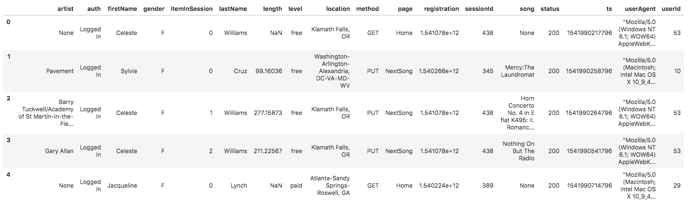

# [DEND-P2] Data Engineering Nanodegree - Project 2: Data Warehouse on AWS with Amazon Redshift 


## Introduction

_The content of the following section is from the project statement provided by Udacity._

>A music streaming startup, Sparkify, has grown their user base and song database and want to move their processes and data onto the cloud. Their data resides in S3, in a directory of JSON logs on user activity on the app, as well as a directory with JSON metadata on the songs in their app.
>
>As their data engineer, you are tasked with building an ETL pipeline that extracts their data from S3, stages them in Redshift, and transforms data into a set of dimensional tables for their analytics team to continue finding insights in what songs their users are listening to. You'll be able to test your database and ETL pipeline by running queries given to you by the analytics team from Sparkify and compare your results with their expected results.


## Project Datasets

_The content of the following section is from the project statement provided by Udacity._

### Song Dataset

> The first dataset is a subset of real data from the [Million Song Dataset](https://labrosa.ee.columbia.edu/millionsong/). Each file is in JSON format and contains metadata about a song and the artist of that song. The files are partitioned by the first three letters of each song's track ID. For example, here are filepaths to two files in this dataset.

```txt
song_data/A/B/C/TRABCEI128F424C983.json
song_data/A/A/B/TRAABJL12903CDCF1A.json
```

> And below is an example of what a single song file, TRAABJL12903CDCF1A.json, looks like.

```json
{"num_songs": 1, "artist_id": "ARJIE2Y1187B994AB7", "artist_latitude": null, "artist_longitude": null, "artist_location": "", "artist_name": "Line Renaud", "song_id": "SOUPIRU12A6D4FA1E1", "title": "Der Kleine Dompfaff", "duration": 152.92036, "year": 0}
```

### Log Dataset

> The second dataset consists of log files in JSON format generated by this [event simulator](https://github.com/Interana/eventsim) based on the songs in the dataset above. These simulate activity logs from a music streaming app based on specified configurations.

> The log files in the dataset you'll be working with are partitioned by year and month. For example, here are filepaths to two files in this dataset.

```shell
log_data/2018/11/2018-11-12-events.json
log_data/2018/11/2018-11-13-events.json
```

> And below is an example of what the data in a log file, 2018-11-12-events.json, looks like.




## Database Schema design

[](https://dbdiagram.io/d/5ecff07d39d18f5553ffe9ca)

As you can see from the diagram above (click on the image for further details) we are using a **Star schema** with `songplays` as a **fact** table and references `users`, `songs`, `artists` and `time` as **dimension** tables. 

The `songplays` fact table consists of the user activity on the music streaming app. The purpose is to analyze the songs users are listening to.

The dimension tables allows us to categorize facts and measures in order to allow the analytics team answer business questions. Using such a schema allows the team to use simplified queries and fast aggregations compared to normalized tables.


## ETL pipeline

The main goals of the ETL pipeline were to:

- Extract the data from Amazon S3 (object storage service) and load it into staging tables in Redshift (data warehouse)

- Transform the data and finally,

- Load the data into the analytical tables


## Getting Started

The following instructions will help you set up the configuration file, create the tables and run the ETL pipeline to populate the analytical tables with the data that is stored in Amazon S3.


### Prerequisites

#### Python packages

The `psycopg2` package must be installed on your machine. 

Use the [pip](https://pypi.org/project/pip/) package installer to install it:

```shell
pip3 install psycopg2
```

#### Data Warehouse configuration file


Please create an Amazon Redshift cluster and fill the `dwh.cfg` file with the following content:

>[CLUSTER]
>HOST='datawarehouse_cluster_name.identifier.aws-region.redshift.amazonaws.com'
>DB_NAME='<datawarehouse_name>'
>DB_USER='<datawarehouse_user_name>'
>DB_PASSWORD='<datawarehouse_password>'
>DB_PORT='<datawarehouse_password_port>'
>
>[IAM_ROLE]
>ARN='arn:aws:iam::<IDENTIFIER>:role/dwhRole'
>
>[S3]
>LOG_DATA='s3://udacity-dend/log_data'
>LOG_JSONPATH='s3://udacity-dend/log_json_path.json'
>SONG_DATA='s3://udacity-dend/song_data'

**Note**: The configuration should be kept private.


#### Create table and run ETL

1. Create the tables in the Redshift cluster (data warehouse) by running the `create_tables.py` Python 3 script:

```shell
python3 create_tables.py
```

2. Run the ETL pipelines to extract the data from Amazon S3 into the staging tables in Redshift, transform and load the data from the staging tables to the analytical tables by running  `etl.py` Python 3 script:

```shell
python3 etl.py
```


## License


**DISCLAIMER:** This project is part of the Data Engineering Nanodegree Program from Udacity. You must abide by [Udacity's Honor of Code](https://udacity.zendesk.com/hc/en-us/articles/210667103-What-is-the-Udacity-Honor-Code-), and in particular, you must submit your own work or attribute my code if you want to use part of my solution.

The project is released under the MIT License. See the [LICENSE.md](LICENSE.md) file for details.

Copyright (c) 2020 Nasseredine Bajwa.
